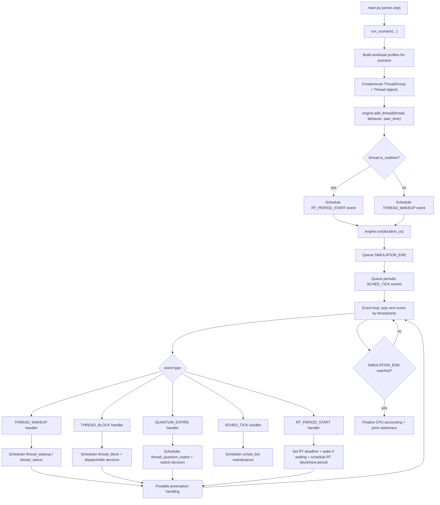
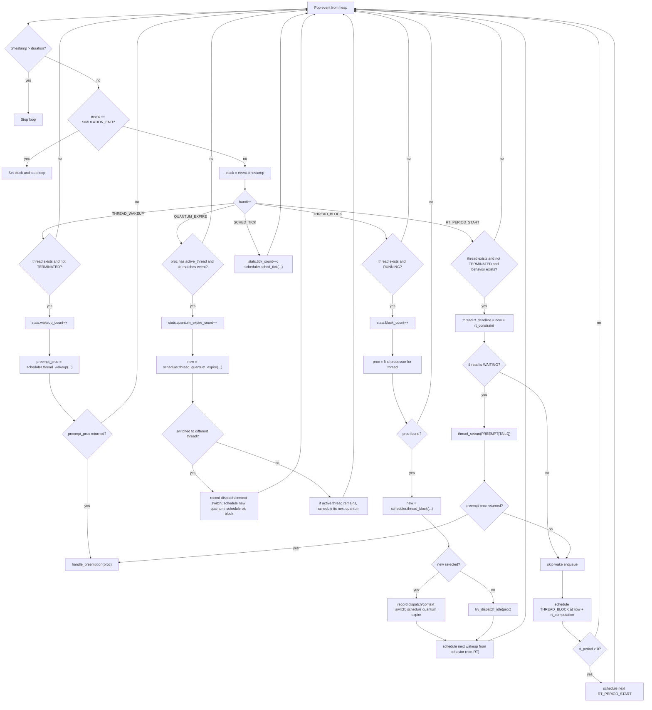
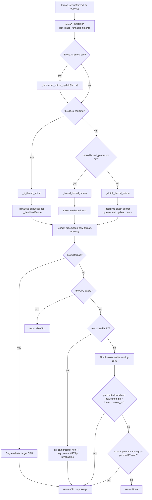
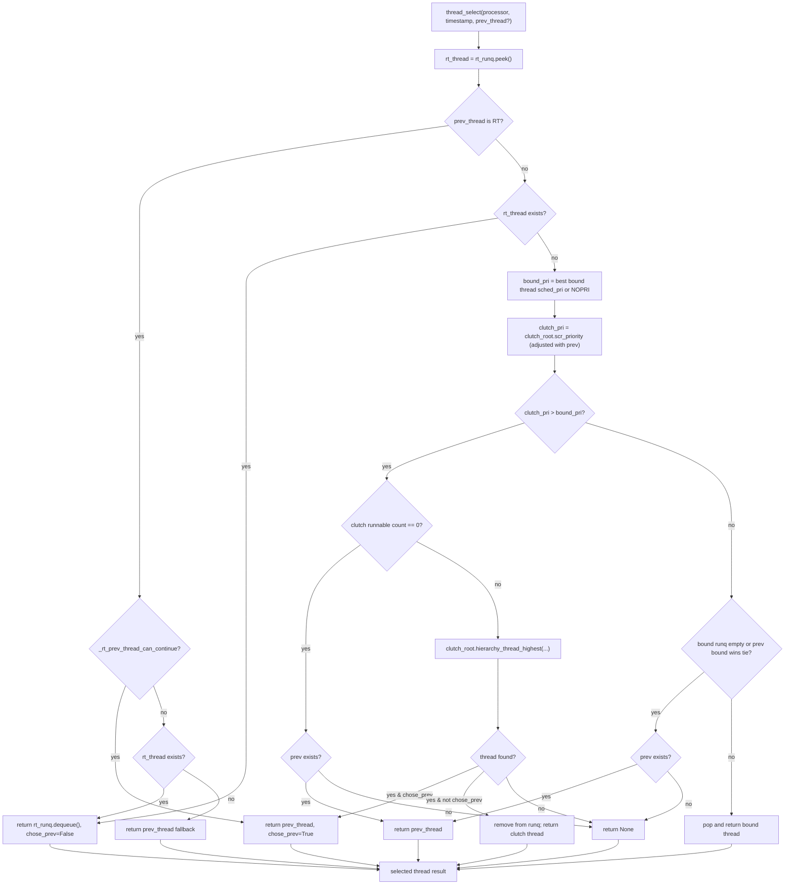
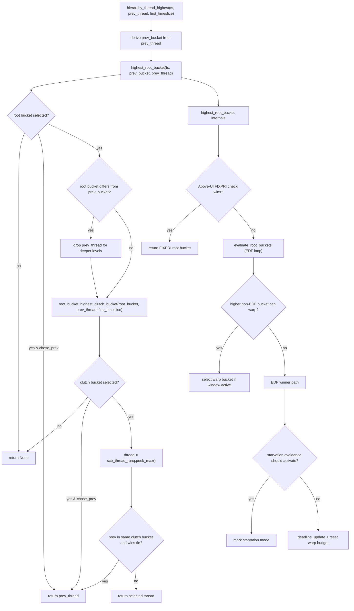
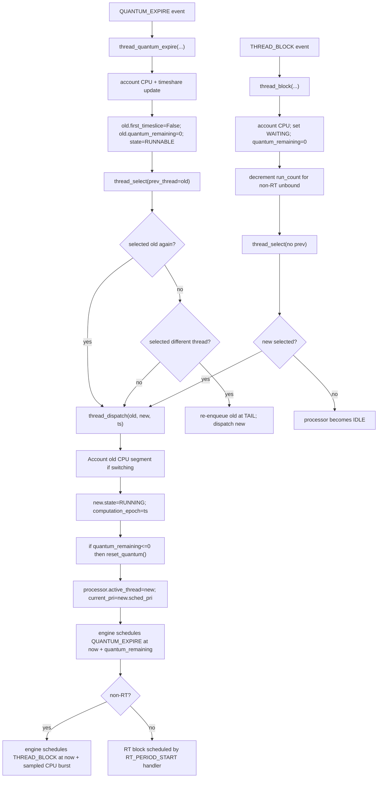
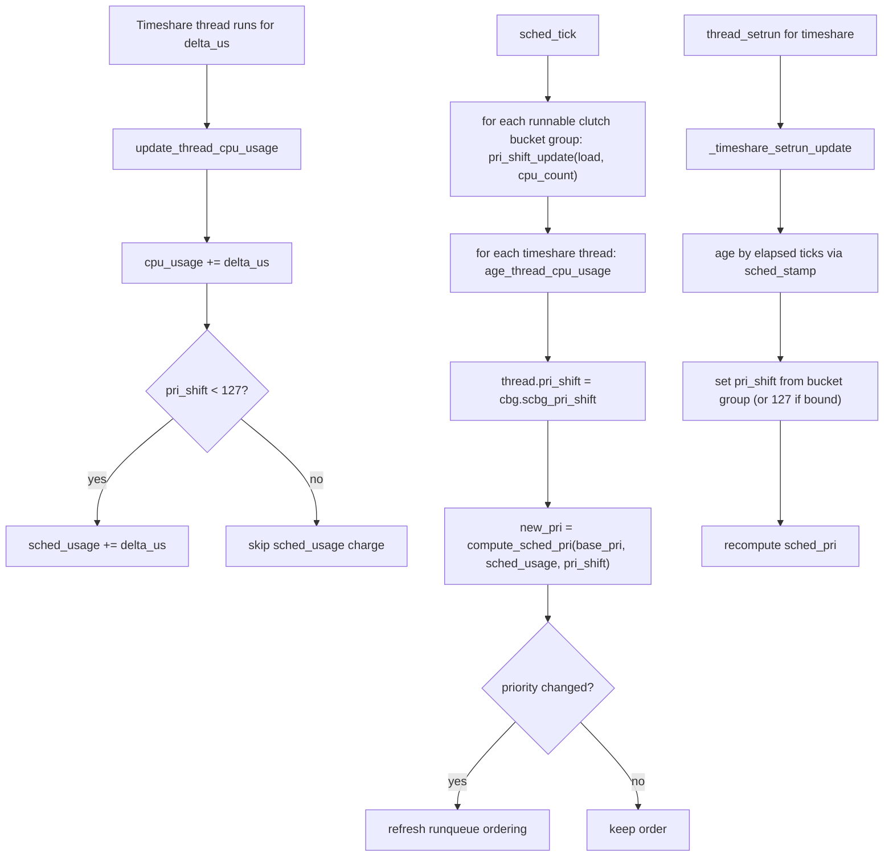
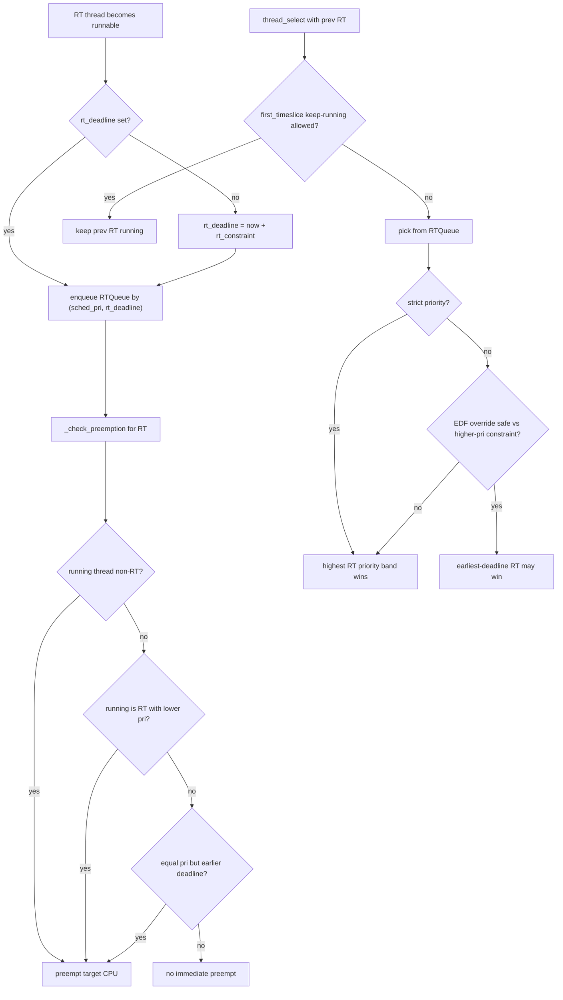

# Complete Simulator Decision Map

This is a full decision map of the simulator, split into focused diagrams so it stays readable.

## 1) End-to-End Control Flow (CLI -> Engine -> Scheduler)

**Element Notes**
- `main.py parses args`: Reads scenario/options and builds run configuration.
- `run_scenario(...)`: Instantiates the simulation engine and workload objects.
- `engine.add_thread(...)`: Registers a thread and its initial wake/period event.
- `THREAD_WAKEUP` / `THREAD_BLOCK` / `QUANTUM_EXPIRE` / `SCHED_TICK` / `RT_PERIOD_START`: Core event types the engine handles.
- `Possible preemption handling`: Scheduler requested an immediate reschedule on some CPU.
- `Finalize CPU accounting + print stats/trace`: Closes in-flight runtime accounting, then reports output.

## 2) Event Engine Decision Logic

**Element Notes**
- `Pop event from heap`: Takes the next event in timestamp/priority order.
- `preempt_proc = scheduler.thread_wakeup(...)`: Wakeup enqueues thread and may request preemption.
- `handle_preemption(proc)`: Performs select-then-dispatch on the chosen CPU.
- `new = scheduler.thread_block(...)`: Marks running thread waiting and tries to pick a replacement.
- `new = scheduler.thread_quantum_expire(...)`: Handles timeslice expiry and next-thread choice.
- `RT_PERIOD_START`: Periodic RT activation point; sets deadline and may wake/enqueue RT thread.
- `schedule ...`: Adds future events back into the event queue.

## 3) `thread_setrun` + Preemption Check

**Element Notes**
- `thread_setrun(...)`: Canonical path for moving a thread to RUNNABLE and enqueueing it.
- `_timeshare_setrun_update`: Ages usage and recomputes dynamic priority for timeshare threads.
- `_rt_thread_setrun`: Inserts thread into RT queue with deadline semantics.
- `_bound_thread_setrun`: Enqueues into a processor-bound runqueue.
- `_clutch_thread_setrun`: Enqueues into the unbound Clutch hierarchy.
- `_check_preemption(...)`: Decides whether a running CPU should be interrupted immediately.
- `return CPU to preempt` vs `return None`: Either trigger a switch now or leave current execution unchanged.

## 4) `thread_select` Decision Tree (core "who runs next")

**Element Notes**
- `prev_thread`: The thread currently on-core, allowed to compete as keep-running candidate.
- `rt_runq.peek()/dequeue()`: RT candidates are evaluated before non-RT candidates.
- `bound_pri`: Best priority among processor-bound runnable threads.
- `clutch_pri`: Best priority from unbound Clutch hierarchy.
- `chose_prev=True`: Scheduler intentionally keeps current thread running.
- `remove from runq`: Selected runnable thread is dequeued before dispatch.
- `return None`: No runnable candidate; CPU goes idle.

## 5) Clutch Hierarchy Decision Flow (non-RT unbound path)

**Element Notes**
- `highest_root_bucket(...)`: Picks the winning QoS root bucket/lane.
- `prev_bucket`: QoS lane of current thread; used for tie/keep-running behavior.
- `root_bucket_highest_clutch_bucket(...)`: Chooses winning thread-group bucket inside root lane.
- `scb_thread_runq.peek_max()`: Reads top runnable thread for that clutch bucket.
- `warp`: Temporary preference that can let a higher lane run sooner.
- `EDF winner path`: Earliest-deadline policy for root bucket fairness.
- `starvation avoidance`: Forces service for delayed lower lanes when required.

## 6) Dispatch / Quantum / Block Decisions

**Element Notes**
- `thread_dispatch(old, new, ts)`: Context-switch/install path for selected thread.
- `QUANTUM_EXPIRE`: Timeslice timer event fired for running thread.
- `thread_quantum_expire(...)`: Select-then-dispatch logic after quantum ends.
- `THREAD_BLOCK`: Voluntary block (sleep/I/O/wait) event.
- `thread_block(...)`: Marks thread waiting and tries replacement selection.
- `re-enqueue old at TAIL`: Old thread stays runnable but moves behind peers for fairness.
- `processor becomes IDLE`: No runnable replacement found.

## 7) Timeshare Dynamic Priority Update Loop

**Element Notes**
- `cpu_usage`: Total charged runtime for the thread.
- `sched_usage`: Decay-sensitive usage that contributes to timeshare penalty.
- `pri_shift`: Load-derived decay aggressiveness (smaller shift => bigger penalty effect).
- `compute_sched_pri(...)`: Recomputes dynamic scheduling priority from usage/shift/base priority.
- `sched_tick`: Periodic global maintenance pass.
- `refresh runqueue ordering`: Reorders runnable queues after priority changes.
- `_timeshare_setrun_update`: Wakeup-time mini-update before enqueue path.

## 8) RT Decision Flow (queue + keep-running + preemption)

**Element Notes**
- `rt_deadline`: Absolute deadline for current RT period window.
- `enqueue RTQueue by (sched_pri, rt_deadline)`: RT ordering key (priority first, deadline as tie/secondary policy).
- `_check_preemption for RT`: Determines whether RT arrival should interrupt current CPU.
- `first_timeslice keep-running`: Fast-path that may let current RT continue safely.
- `strict priority`: If enabled, higher RT priority dominates over deadline crossover.
- `EDF override safe`: Non-strict mode can use deadline ordering when constraint-safe.
- `preempt target CPU`: Immediate reschedule request to run better RT work.

---

## Reading Order

If you want "the whole thing" as one walkthrough, read in this order:

1. Diagram 1 (global control flow)
2. Diagram 2 (event engine)
3. Diagram 3 (`thread_setrun` + preemption)
4. Diagram 4 (`thread_select`)
5. Diagram 5 (Clutch hierarchy internals)
6. Diagram 6 (dispatch/quantum/block)
7. Diagram 7 (timeshare priority dynamics)
8. Diagram 8 (RT specifics)
