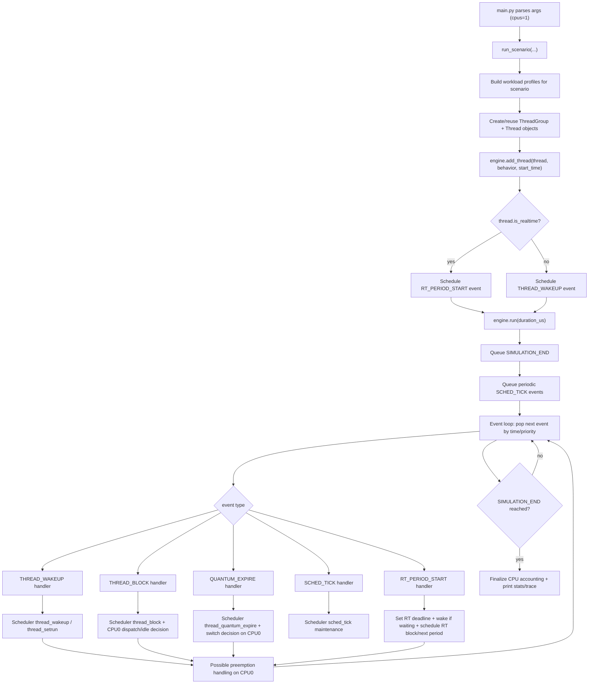
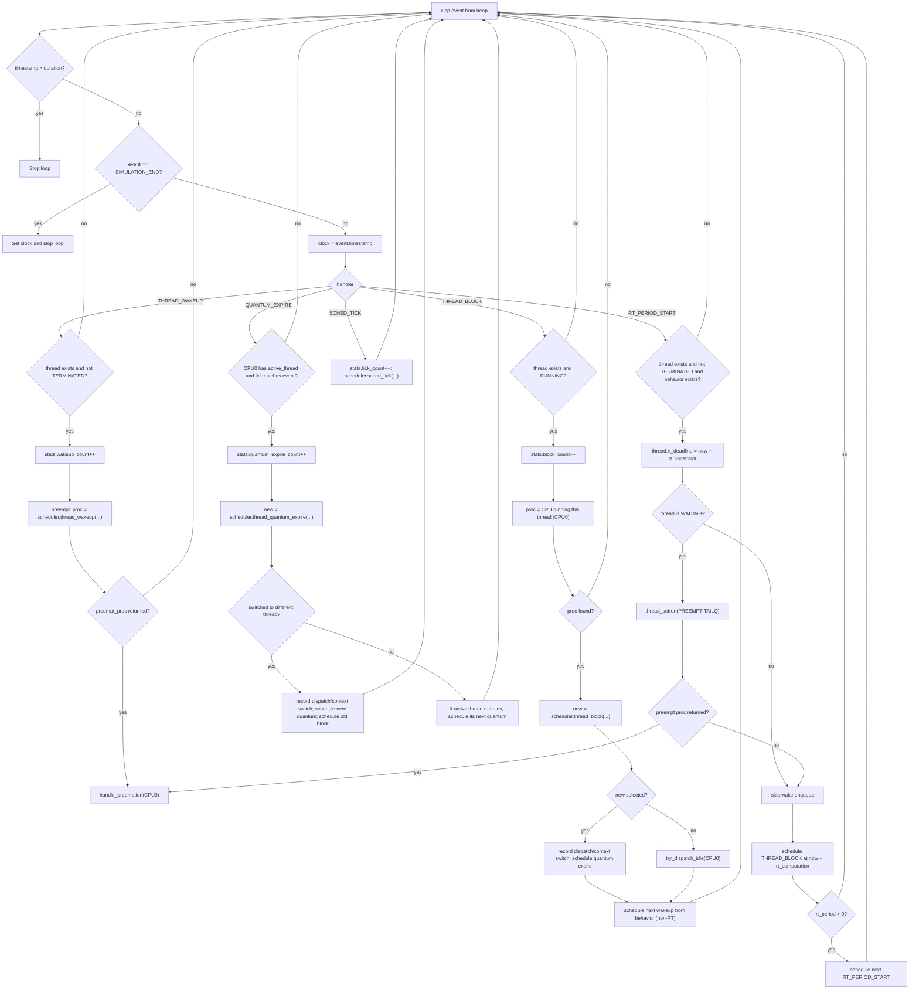
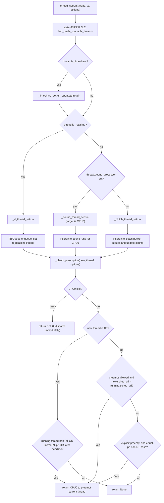
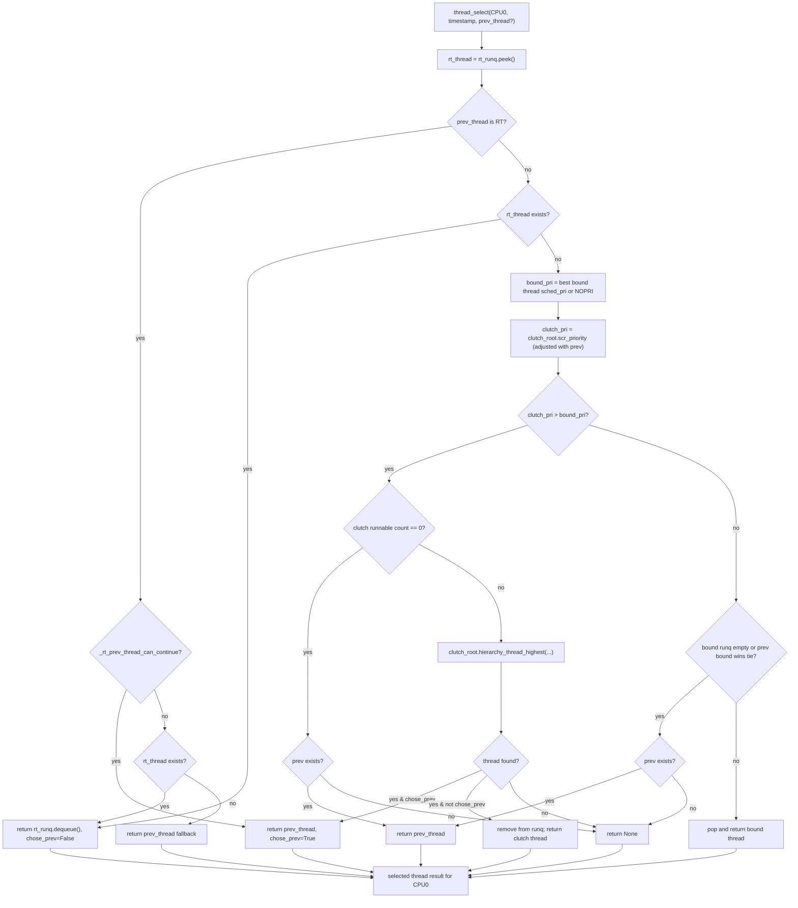
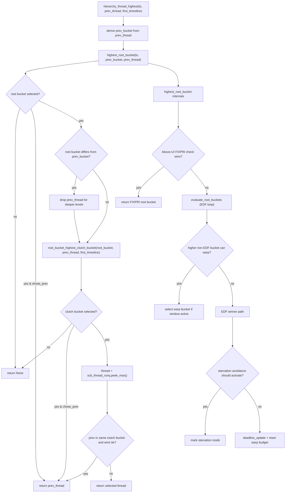
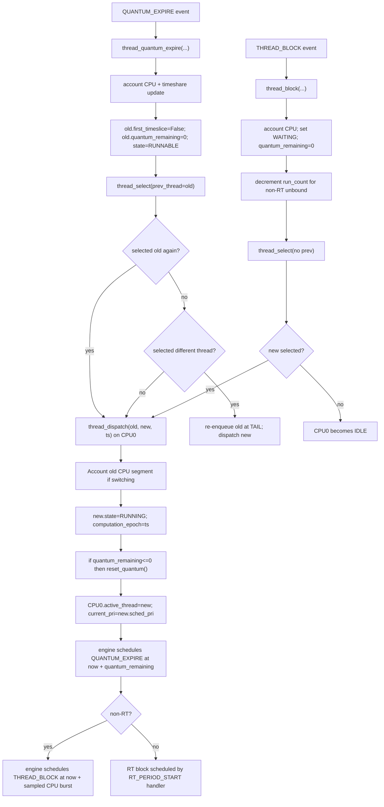
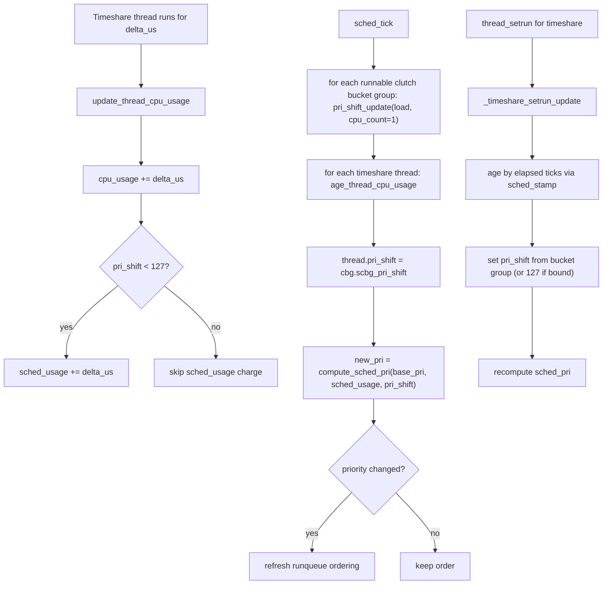
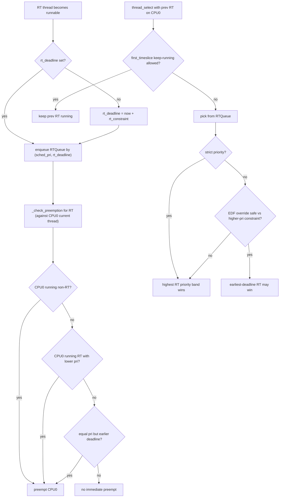

# Complete Simulator Decision Map (Single CPU)

This is the full decision map for the same simulator when only one CPU exists (`--cpus 1`).

## 1) End-to-End Control Flow (CLI -> Engine -> Scheduler, 1 CPU)

**Element Notes**
- `main.py parses args (cpus=1)`: Reads scenario/options with a single logical CPU.
- `run_scenario(...)`: Instantiates engine/scheduler and workload objects.
- `engine.add_thread(...)`: Registers thread and initial event (wake or RT period start).
- `THREAD_WAKEUP` / `THREAD_BLOCK` / `QUANTUM_EXPIRE` / `SCHED_TICK` / `RT_PERIOD_START`: Core event types.
- `Possible preemption handling on CPU0`: Scheduler requested an immediate reschedule on the only CPU.
- `Finalize CPU accounting + print stats/trace`: Closes runtime accounting, then reports output.

## 2) Event Engine Decision Logic (1 CPU)

**Element Notes**
- `Pop event from heap`: Takes the next timestamp/priority-ordered event.
- `preempt_proc = scheduler.thread_wakeup(...)`: Wakeup enqueues thread and may request preemption.
- `handle_preemption(CPU0)`: Performs select-then-dispatch on the only CPU.
- `new = scheduler.thread_block(...)`: Marks running thread waiting and tries replacement.
- `new = scheduler.thread_quantum_expire(...)`: Handles timeslice expiry and next-thread choice.
- `RT_PERIOD_START`: Periodic RT activation; sets deadline and may enqueue RT thread.
- `schedule ...`: Adds future events back into the queue.

## 3) `thread_setrun` + Preemption Check (1 CPU)

**Element Notes**
- `thread_setrun(...)`: Canonical path for marking a thread RUNNABLE and enqueueing it.
- `_timeshare_setrun_update`: Ages usage and recomputes dynamic priority.
- `_rt_thread_setrun`: Inserts runnable RT thread into RT queue.
- `_bound_thread_setrun`: Enqueues thread into CPU0-bound runqueue.
- `_clutch_thread_setrun`: Enqueues thread into unbound Clutch hierarchy.
- `_check_preemption(...)`: Decides whether CPU0 should switch immediately.
- `return CPU0` vs `return None`: Trigger immediate reschedule now or keep current execution.

## 4) `thread_select` Decision Tree (1 CPU core "who runs next")

**Element Notes**
- `prev_thread`: Current CPU0 thread, still eligible to keep running.
- `rt_runq.peek()/dequeue()`: RT candidates are considered before non-RT.
- `bound_pri`: Best priority among CPU0-bound runnable threads.
- `clutch_pri`: Best priority from unbound Clutch hierarchy.
- `chose_prev=True`: Keep current thread running intentionally.
- `remove from runq`: Dequeue selected runnable thread before dispatch.
- `return None`: No runnable candidate; CPU0 idles.

## 5) Clutch Hierarchy Decision Flow (non-RT unbound path, 1 CPU)

**Element Notes**
- `highest_root_bucket(...)`: Chooses winning QoS root lane.
- `prev_bucket`: Current thread’s lane for tie/keep-running rules.
- `root_bucket_highest_clutch_bucket(...)`: Chooses winning thread-group bucket in that lane.
- `scb_thread_runq.peek_max()`: Reads top runnable thread in selected bucket.
- `warp`: Temporary preference that can elevate service for a higher lane.
- `EDF winner path`: Earliest-deadline choice for root-level fairness.
- `starvation avoidance`: Ensures delayed lower lanes eventually receive CPU0 service.

## 6) Dispatch / Quantum / Block Decisions (1 CPU)

**Element Notes**
- `thread_dispatch(old, new, ts) on CPU0`: Context-switch/install path on the only CPU.
- `QUANTUM_EXPIRE`: Timeslice timer for current thread fired.
- `thread_quantum_expire(...)`: Select-then-dispatch after quantum end.
- `THREAD_BLOCK`: Voluntary block event (sleep/I/O/wait).
- `thread_block(...)`: Marks thread waiting and chooses replacement.
- `re-enqueue old at TAIL`: Old thread remains runnable but yields queue position.
- `CPU0 becomes IDLE`: No runnable replacement exists.

## 7) Timeshare Dynamic Priority Update Loop (1 CPU)

**Element Notes**
- `cpu_usage`: Total charged runtime for this thread.
- `sched_usage`: Decay-sensitive usage used for timeshare penalty.
- `pri_shift`: Load-derived penalty aggressiveness.
- `compute_sched_pri(...)`: Recomputes dynamic priority from usage/base/shift.
- `sched_tick`: Periodic maintenance pass.
- `refresh runqueue ordering`: Reorders queues after priority changes.
- `_timeshare_setrun_update`: Wakeup-time update before enqueue.

## 8) RT Decision Flow (1 CPU)

**Element Notes**
- `rt_deadline`: Absolute deadline for active RT period.
- `enqueue RTQueue by (sched_pri, rt_deadline)`: RT ordering key.
- `_check_preemption for RT (against CPU0 current thread)`: Decide immediate CPU0 interruption.
- `first_timeslice keep-running`: May allow current RT to continue safely.
- `strict priority`: If on, RT priority dominates over deadline crossover.
- `EDF override safe`: In non-strict mode, deadline-based choice only when safe.
- `preempt CPU0`: Immediate reschedule request for better RT candidate.

---

## Reading Order

Read in this order for the full single-CPU walkthrough:

1. Diagram 1 (global control flow)
2. Diagram 2 (event engine)
3. Diagram 3 (`thread_setrun` + preemption)
4. Diagram 4 (`thread_select`)
5. Diagram 5 (Clutch hierarchy internals)
6. Diagram 6 (dispatch/quantum/block)
7. Diagram 7 (timeshare priority dynamics)
8. Diagram 8 (RT specifics)
