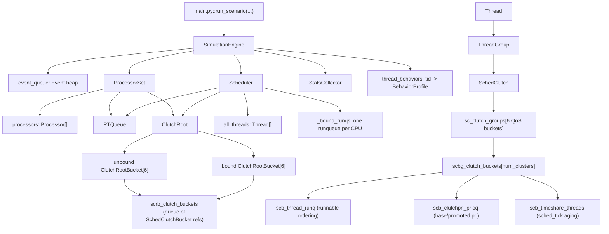
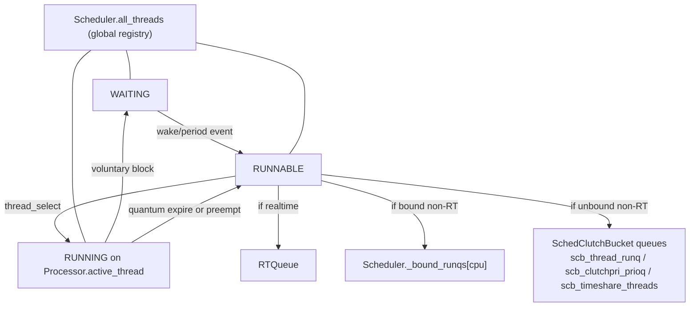
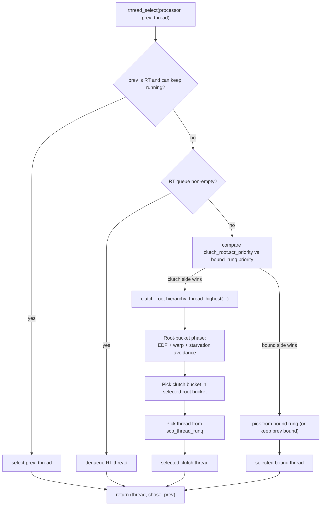
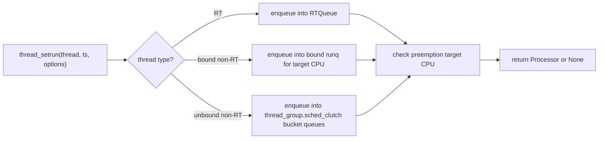
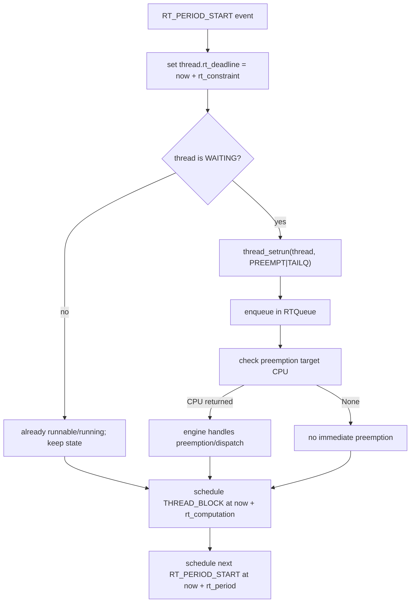
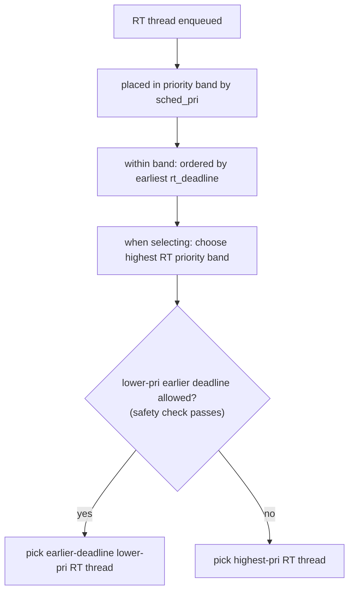

# Simulator Object Diagrams

## 1) Static Object Hierarchy (Ownership + References)

## 2) Where Threads Live By State

## 3) Selection Flow (`thread_select`)

## 4) Enqueue Paths (`thread_setrun`)

## 5) RT (Real-Time) Lifecycle

## 6) RTQueue Ordering and Pick Rules

## RT Reading Guide

- `RT` threads do not use normal Clutch timeshare queues while runnable; they use `RTQueue`.
- In `thread_select`, any eligible RT candidate is considered before non-RT queues.
- RT can preempt non-RT immediately when preemption checks choose a processor.
- RT periodic behavior is event-driven: `RT_PERIOD_START` activates, `THREAD_BLOCK` ends computation slice.
